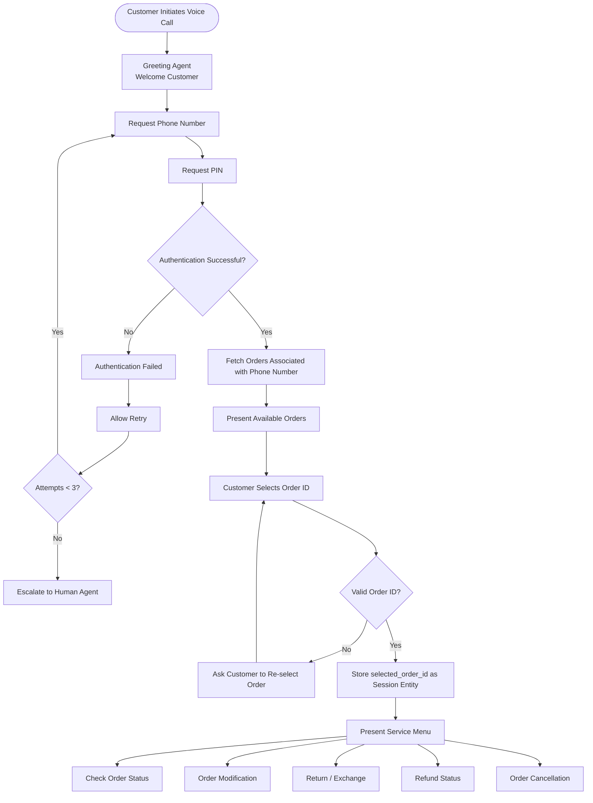
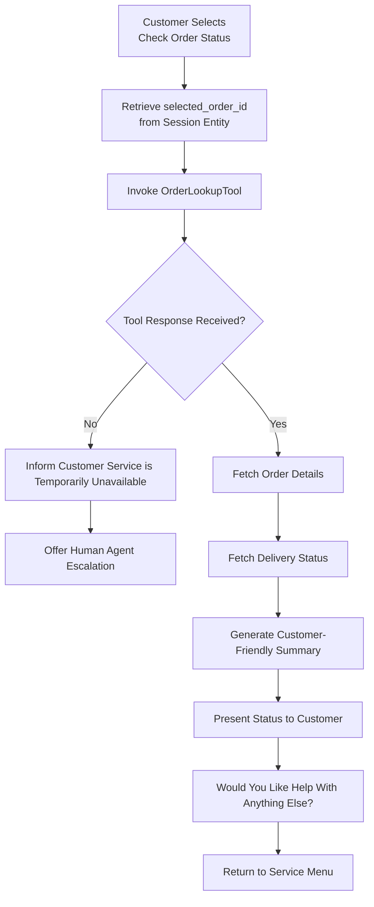
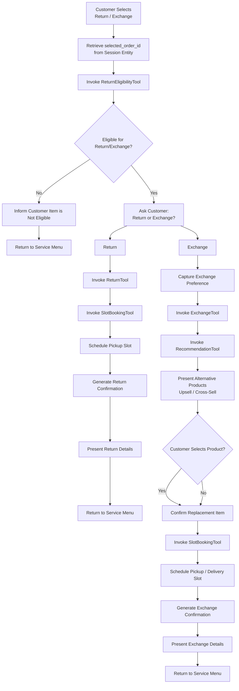
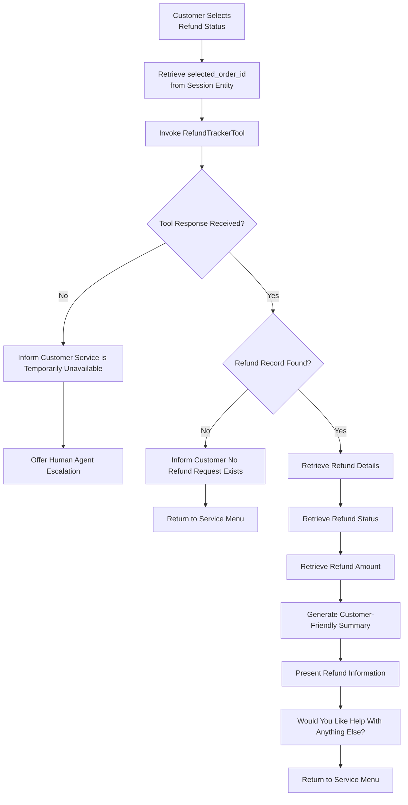
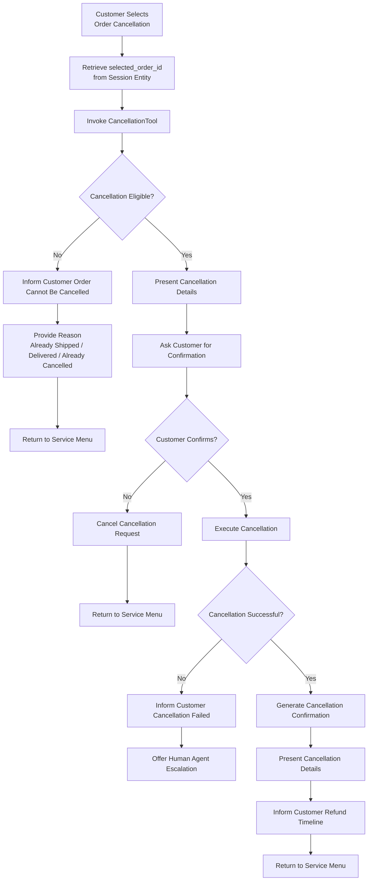

# Conversational Architecture

## Overview

The Retail Fashion Voice Agent is designed to automate common customer support journeys through a secure, voice-enabled conversational experience.

The system authenticates customers using Phone Number and PIN verification before allowing access to order-related actions.

Once authenticated, the agent retrieves all orders associated with the customer account, enables order selection, and routes requests to specialized sub-agents responsible for specific business functions.

The architecture follows a modular multi-agent approach where each customer journey is handled independently while sharing a common authentication and order-context layer.

---

## Architecture Principles

The solution is designed around the following principles:

- Secure customer authentication
- Context-aware conversations
- Modular agent design
- API-driven business operations
- Controlled escalation handling
- Reusable conversational components

---

# Main Agent Flow

## Purpose

The Main Agent acts as the orchestration layer for the entire customer journey.

### Responsibilities

- Customer greeting
- Authentication
- Customer profile retrieval
- Order retrieval
- Order selection
- Session context management
- Service routing

### Session Entity Stored

- selected_order_id

---

# Order Status Sub-Agent

## Purpose

Provide customers with real-time order and delivery status information.

### Primary Tool

- OrderLookupTool

### Expected Outcome

Customer receives current order status and delivery information.

---

# Order Modification Sub-Agent

## Purpose

Allow customers to modify eligible orders.

### Supported Modifications

- Delivery Address
- Delivery Date
- Contact Number

### Primary Tool

- OrderModificationTool

### Expected Outcome

Order details are updated successfully after customer confirmation.

---

# Return / Exchange Sub-Agent

## Purpose

Handle customer return and exchange requests.

### Primary Tools

- ReturnEligibilityTool
- ReturnTool
- ExchangeTool
- RecommendationTool
- SlotBookingTool

### Expected Outcome

Return pickup or exchange process is successfully initiated.

---

# Refund Status Sub-Agent

## Purpose

Provide refund tracking and status updates.

### Primary Tool

- RefundTrackerTool

### Expected Outcome

Customer receives refund amount, refund status, and processing information.

---

# Order Cancellation Sub-Agent

## Purpose

Handle eligible order cancellation requests.

### Primary Tool

- CancellationTool

### Expected Outcome

Order cancellation request is processed and confirmation is provided.

---

# Error Handling Strategy

The system handles the following failure scenarios:

- Authentication failures
- Invalid order selection
- Tool execution failures
- API timeouts
- Business rule violations

When automated resolution is not possible, the conversation is transferred to a human support agent with context preservation.

---

# Session Context Management

| Entity | Purpose |
|----------|----------|
| customer_id | Customer identification |
| selected_order_id | Selected order context |
| service_type | Active customer journey |
| authentication_status | Verification status |

---

# Escalation Strategy

Escalation is triggered when:

- Authentication fails after multiple attempts
- Backend services are unavailable
- Customer explicitly requests a human agent
- Business rules prevent automated resolution

Conversation context is transferred to minimize customer effort and repetition.
