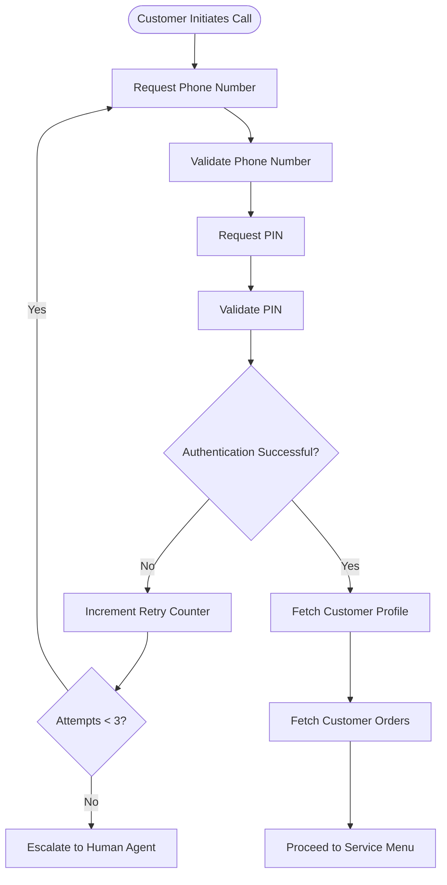

# Authentication Flow

## Purpose

Authentication serves as the security boundary for all account-related operations.

Customers must successfully authenticate before accessing:

- Order Status
- Order Modification
- Return / Exchange
- Refund Status
- Order Cancellation

---

## Authentication Workflow

---

## Inputs

| Input | Description |
|----------|----------|
| phone_number | Customer phone number |
| pin | Customer authentication PIN |

---

## Session Context Created

| Entity | Purpose |
|----------|----------|
| customer_id | Customer identification |
| authentication_status | Authentication result |
| order_list | Customer orders |
| selected_order_id | Order selected later in the journey |

---

## Authentication Rules

- Authentication is required before accessing account information.
- Maximum authentication attempts: 3.
- Failed authentication after 3 attempts triggers escalation.
- Customer context is maintained for the duration of the session.

---

## Expected Outcome

Authenticated customers can securely access order-related services and proceed to the service menu.
